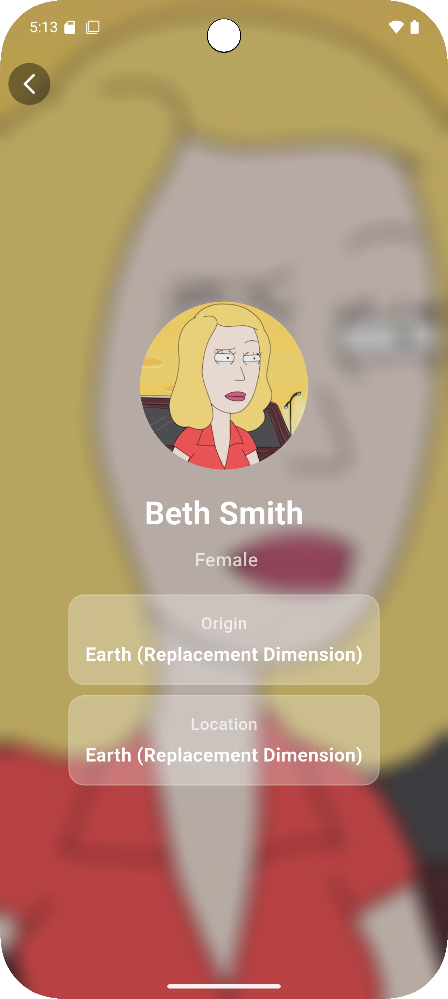
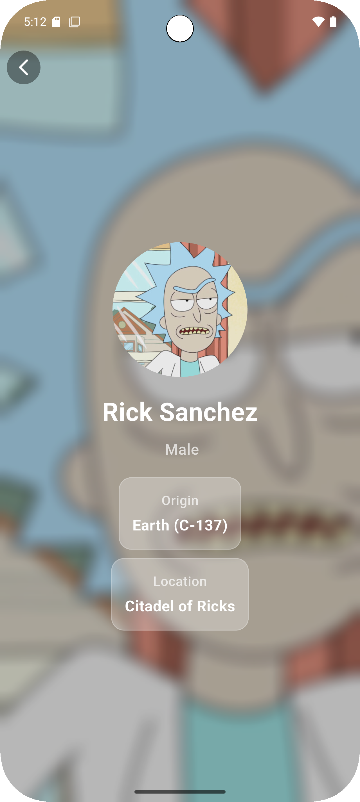
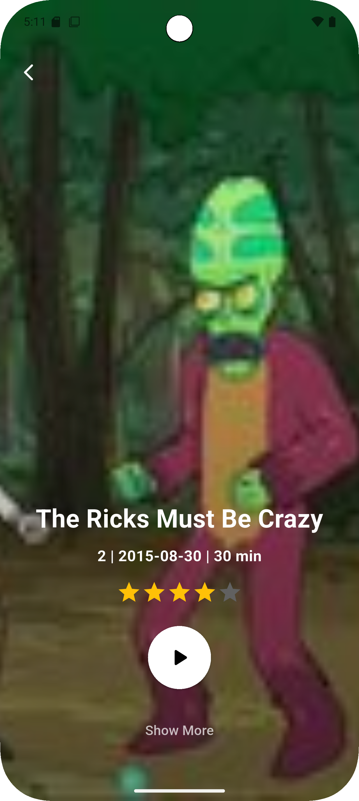

# Rick and Morty App

A Flutter application built using **BLoC architecture**, displaying Rick and Morty shows, seasons, and episodes with a clean and modern interface.

---

##  Features
- Fetching and displaying seasons from TVMaze API  
- Filtering and listing episodes per season  
- Detailed Episode Page with background blur effect  
- Organized project structure using Flutter BLoC  

---

## Tech Stack

| Category | Tools |
|-----------|--------|
| Framework | Flutter |
| State Management | flutter_bloc |
| API | TVMaze API |
| Language | Dart |
| Architecture | BLoC Pattern |

---

##  APIs Used

- **Seasons:** `https://api.tvmaze.com/shows/{show_id}/seasons`  
- **Episodes:** `https://api.tvmaze.com/shows/{show_id}/episodes`

---

##  Screenshots

| Home | Season Details | Character Details | Episode Details |
|------|----------------|------------------|-----------------|
|  |     |     |  |

---

##  About

Built by **Rana**  
Using Flutter and BLoC for clean and scalable development.
